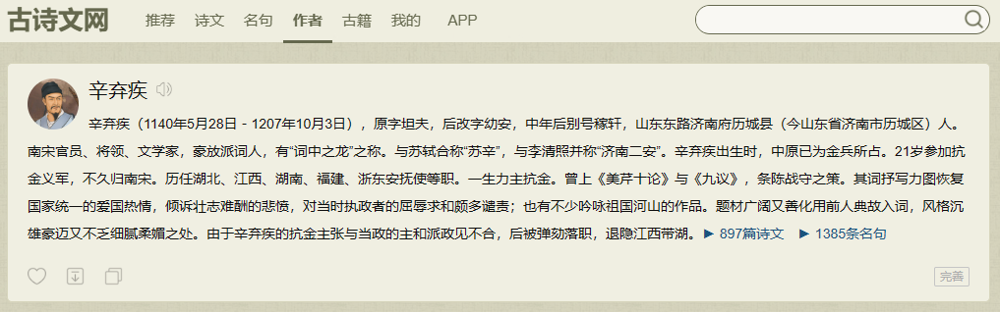
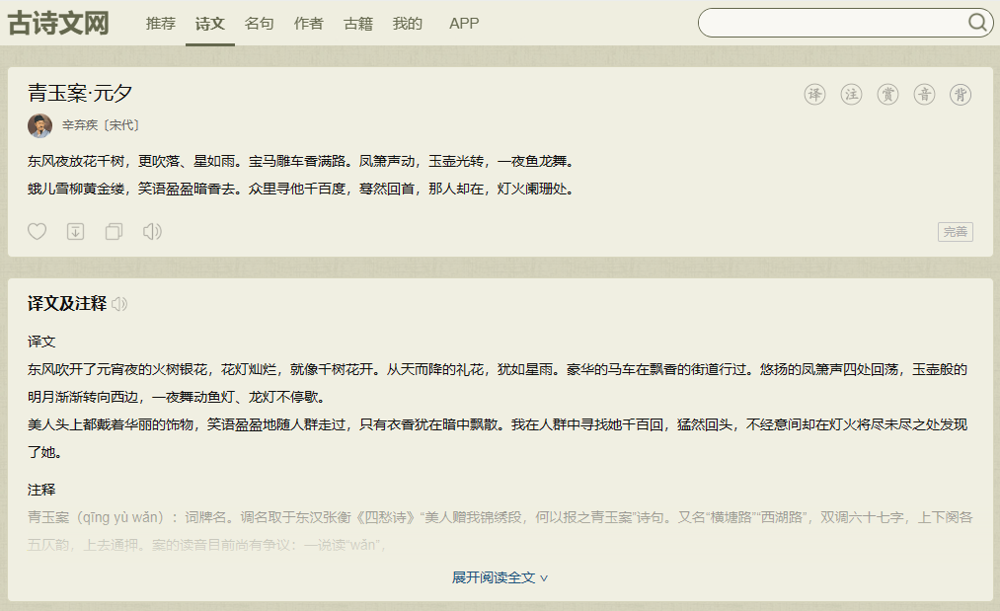
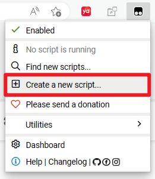
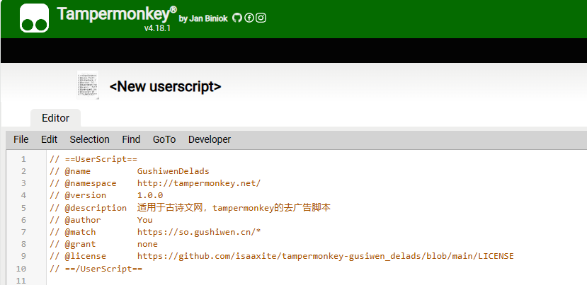

# Tampermonkey Gusiwen Delads

适用于[古诗文网]，tampermonkey的去广告脚本

# 特性

  
<strong>禁用复制文本的弹窗</strong>

  
<strong>删除作者详情页广告并调整样式</strong>

  

  
<strong>删除诗词详情页广告并调整样式</strong>

  
  

# 安装

tampermonkey-gusiwen_delads 是 Tampermonkey 的脚本，因此你需要先安装 [Tampermonkey]。

## 使用 greasyfork 安装

[GushiwenDelads](https://greasyfork.org/en/scripts/467864-gushiwendelads) > [Install this script](https://greasyfork.org/scripts/467864-gushiwendelads/code/GushiwenDelads.user.js)

## 手动安装

复制 [dis\/gusiwen_delads.min.js] 的内容，以此在 Tampermonkey 的 dashboard新建脚本。

setp1: Create a new script

setp2：粘贴 [dis\/gusiwen_delads.min.js] 内容

step3：保存

# 赞赏

<strong>Buy me a Coffee</strong>

|||
|:--:|:--:|

# 友情链接

- [Isaac Kam's Blog]

# License

[MIT] @ [isaaxite]

[MIT]: xxx
[isaaxite]: https://github.com/isaaxite
[Tampermonkey]: https://chrome.google.com/webstore/detail/tampermonkey/dhdgffkkebhmkfjojejmpbldmpobfkfo/related
[Isaac Kam's Blog]: https://isaaxite.github.io/blog/
[dis\/gusiwen_delads.min.js]: https://raw.githubusercontent.com/isaaxite/tampermonkey-gusiwen_delads/main/dist/gusiwen_delads.min.js
[古诗文网]:https://www.gushiwen.cn/